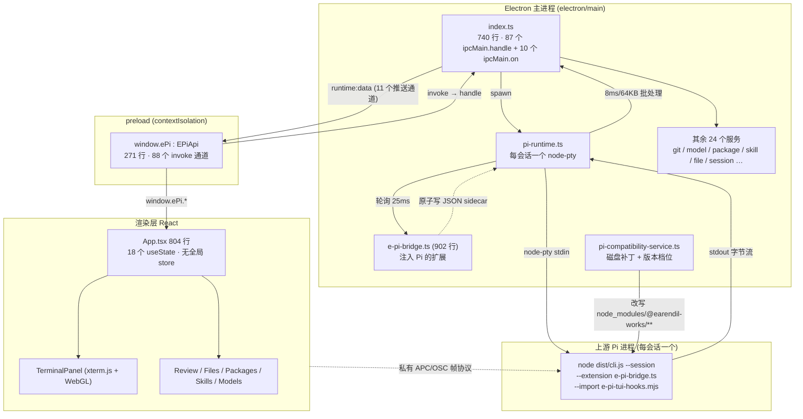

# E-Pi 代码库工程调研报告

> 调研方式：8 个并行子代理分头阅读源码 + 主机侧独立复核关键结论。
> 证据约定：所有断言均给出 `file:line`；标注「已复核」的结论由本次调研亲自复现，未复核的来自子代理静态阅读。
> 调研基线：工作区当前状态（脏工作树，含未提交的 Pi 0.85 适配改动）。

---

## 1. 摘要

E-Pi 是一个 Electron 43 + React 19 桌面外壳，把上游 Pi Coding Agent 的 CLI 包装成原生多会话工作台：每个会话一个 `node-pty` 进程，渲染层用 xterm.js 直接呈现 Pi 自己的全屏 TUI，并补上 Git Review、包管理、Skill 管理、模型配置等面板。代码规模约 **34,000 行** TS/TSX（`src` 115 文件 + `electron` 26 文件 + `resources`），另有 **45 个测试文件约 7,100 行**。

它最有意思的工程事实是：**为了把 TUI 嵌进 xterm 并做虚拟滚动/视口同步，E-Pi 同时用了两套上游改写机制**——磁盘上的手写 unified diff 补丁（按 `major.minor` 分档，对上游 `dist/` 内部实现打 18+ hunk），以及内存里的 ESM loader 注入器（`resources/e-pi-tui-hooks.mjs`，直接猴补 `TuiAltScreen.prototype`）。终端子系统为此积累了 16 个 `src/lib` 辅助模块，实现了一套私有的 APC/OSC 协议来做重绘同步。

它最大的风险也是同一件事：**这层补丁依赖上游 `dist` 的字符串与私有 API**。上游从 0.84 走到 0.85.1 只用了数周，已经因为重命名把补丁打挂过一次（`wheelScrollLines` → `getWheelScrollLines`）；补丁失配不是构建错误，而是**静默降级**成 stock pi-tui。叠加「无 CI、无 tag、两个作者、工作树里整块 0.85 适配代码尚未提交」，这是目前最需要处置的结构性风险。

---

## 2. 项目定位与技术栈

| 维度        | 事实                                                                | 证据                                     |
| ----------- | ------------------------------------------------------------------- | ---------------------------------------- |
| 定位        | Pi Coding Agent 的桌面 GUI 外壳（不是上游 fork，唯一上游是 npm 包） | `package.json:46,57`；`git remote -v`    |
| 版本/许可   | `0.1.0`、`private: true`、MIT © 2026 JustGenius                     | `package.json:3-4,7`                     |
| 桌面        | Electron 43.2.0 + electron-vite 5.0.0                               | `package.json:70,72`                     |
| 前端        | React 19.2.8 + TypeScript 7.0.2 + Tailwind 4 + Radix/shadcn         | `package.json:80-89`                     |
| 终端        | `@xterm/xterm` 6.0.0 + WebGL addon + `node-pty` 1.1.0               | `package.json:64-67,49`                  |
| 编辑器/预览 | CodeMirror 6 全家桶、mermaid、react-markdown                        | `package.json:29-45`                     |
| Diff        | `@pierre/diffs` 1.2.11                                              | `package.json:58`                        |
| 上游耦合    | `@earendil-works/pi-coding-agent` 与 `pi-tui` **精确锁 0.84.2**     | `package.json:46,57`                     |
| 质量工具    | oxlint + oxfmt + vitest 4 + husky pre-commit                        | `package.json:23-25,91-94`               |
| CI          | **不存在**（无 `.github/`，无任何 CI 配置）                         | `ls .github` → No such file or directory |
| 代码规模    | src+electron+resources 34,179 行；测试 7,133 行                     | `find …                                  | wc -l` |

**作者与历史**：206 次提交（2026-08-04 → 08-21），51 个分支，**0 个 tag**。提交者分布为 `morisi@tencent.com` 109、`jiahaoqian@tencent.com` 79、`JustGenius-s` 15、`Rory` 8；其中 JustGenius-s 的 15 次全部是 `Merge pull request #N from Rory-X/…`，Rory 的 8 次就是这些合并——**JustGenius/Rory 只是合并通道，实质贡献者只有两人**。公开仓 `origin/master` 落后本地 HEAD 13 个提交。

---

## 3. 系统架构

### 3.1 分层与数据流



### 3.2 关键数字（已复核）

| 项目                         | 数值                           | 说明                                              |
| ---------------------------- | ------------------------------ | ------------------------------------------------- |
| `ipcMain.handle` 唯一通道    | **87**                         | 全部集中在 `electron/main/index.ts`，无第二处注册 |
| `ipcMain.on`（单向、无回执） | **10**                         | `app:log`、`runtime:write`、`side-terminal:*` 等  |
| preload `invoke` 通道        | **88**                         | 比 handle 多 1，两侧仅靠约定同步                  |
| 主→渲染推送通道              | **11**                         | 来自 14 处 `sendToRenderer` 调用                  |
| 服务层                       | 26 文件 / 7,430 行             | `electron/main/services/`                         |
| 渲染组件                     | 78 个 `.tsx`，**0 个组件测试** | 45 个测试文件全是 `.test.ts`                      |

### 3.3 服务清单

| 服务                           | 行数 | 职责                                             | 关键风险                                   |
| ------------------------------ | ---- | ------------------------------------------------ | ------------------------------------------ |
| `pi-runtime.ts`                | 812  | 每会话 PTY 生命周期、输出批处理、就绪探测        | **无直接测试**；`reloadAll` 会杀掉全部会话 |
| `model-service.ts`             | 779  | 模型目录、登录、自定义 provider                  | 每次调用重建 `ModelRuntime`                |
| `git-service.ts`               | 472  | status/diff/stage/commit/push、AI commit message | **rename numstat 解析 bug**；单仓监听      |
| `pi-compatibility-service.ts`  | 406  | 对上游 `dist/` 打磁盘补丁                        | 模糊匹配可「成功」打到漂移版本             |
| `app-launch-service.ts`        | 355  | macOS `.app` 枚举、Open With 排序                | 平台分支零测试                             |
| `command-service.ts`           | 350  | 内置/模板/插件斜杠命令                           | —                                          |
| `file-service.ts`              | 343  | 工作区 fs API（唯一有路径约束的服务）            | 约束基准 cwd 由渲染层提供                  |
| `open-with-rank.ts`            | 321  | 纯排序启发式（有测试）                           | —                                          |
| `session-service.ts`           | 297  | Pi JSONL 会话 + 归档索引                         | 手写复用上游格式                           |
| `package-service.ts`           | 243  | 包安装/搜索/更新                                 | **始终全局安装**；无 Node 时报 ENOENT      |
| `skill-service.ts`             | 233  | Skill 发现/启停/删除                             | **`read()` 无路径约束**                    |
| `pi-agent-loader.ts`           | 194  | 解析并动态 import 上游包                         | 7 个服务的依赖枢纽，可抛异常               |
| `workspace-watcher-service.ts` | 194  | 多根目录文件监听                                 | 只在渲染层被单 cwd 调用                    |
| `side-terminal-service.ts`     | 180  | 侧边终端 PTY + 交互模式探测                      | `stty` 平台差异                            |
| `project-service.ts`           | 135  | 项目/文件夹注册表                                | —                                          |
| `notification-service.ts`      | 130  | 任务完成通知                                     | 与渲染层重复实现同一边沿检测               |
| `output-batcher.ts`            | 104  | 8ms/64KB 输出批处理                              | `dispose()` 从未被调用                     |
| `npm-path.ts`                  | 105  | 解析 PATH 中的 Node/npm                          | 启动后新装的 Node 不生效                   |
| `agent-config-service.ts`      | 87   | Pi agent 配置写入                                | 静默覆盖风险                               |
| `app-settings-service.ts`      | 81   | `app-settings.json`                              | —                                          |
| `debug-log.ts`                 | 41   | `E_PI_DEBUG=1` 才写日志                          | 用户不可达、无日志查看器                   |

### 3.4 IPC 契约的薄弱点

- **通道名是裸字符串字面量**，在 `index.ts` 与 `preload/index.ts` 各写一遍，全仓**没有任何通道常量**。类型系统只覆盖方法名与载荷（`src/types/contracts.ts` 的 `EPiApi`，:614），**改错通道名能通过编译**，只在运行时表现为「`invoke` 无人应答」。
- preload 的 88 个调用全是 `ipcRenderer.invoke(...) as Promise<T>` 裸转型，无包裹、无统一错误类型。因此 `FsBridgeError.code` 过不了 IPC，只能把错误码编进 `Error.message`（`[E-PI-FS:CODE]` 前缀，`file-service.ts:36-47`），渲染层再正则解析回来。
- 沙箱姿态本身正确（`contextIsolation: true`、`nodeIntegration: false`、`sandbox: true`，`index.ts:578-583`），但**没有任何 `event.senderFrame`/`sender` 校验**，且 `app:image-data`（`index.ts:332`）完全无路径约束。

---

## 4. 核心子系统深剖

### 4.1 与上游 Pi 的集成（最脆弱的一环）

**进程模型**：`Map<sessionPath, Instance>`，每会话一个 `node-pty` 跑 `node dist/cli.js --session <file> --extension resources/e-pi-bridge.ts`，可选追加 `--import e-pi-tui-preload.mjs` 与 `--tui-mode fullscreen`（`pi-runtime.ts:415-435`）。使用随包分发的 sidecar Node（`resources/node/bin/node`）而非 `process.execPath`，只为避免 macOS 多出一个 Dock 图标（`pi-runtime.ts:86-99`）。

**「就绪」不是握手**：主进程每 25ms 轮询 `<session>.e-pi-activity.json` 是否含 `status: busy|idle`，30 秒超时、每次 PTY 输出重新计时（`pi-runtime.ts:573-617`）。遥测由 `e-pi-bridge.ts` 原子写入（tmp+rename，`e-pi-bridge.ts:410-436`）。

**两套上游改写机制**：

| 机制              | 位置                                                                                     | 作用方式                                            | 失配后果                                                                      |
| ----------------- | ---------------------------------------------------------------------------------------- | --------------------------------------------------- | ----------------------------------------------------------------------------- |
| 磁盘 unified diff | `patches/@earendil-works__pi-tui@{0.84.2,0.85.0,0.85.1}.patch`（各约 34KB / 776-777 行） | 按 `major.minor` 分档，事务式应用 + 回滚 + 标记探测 | 新 minor 无档位 → 抛 `E_PI_TUI_COMPATIBILITY_REQUIRED`，UI 提供「降级 stock」 |
| 内存 ESM 注入器   | `resources/e-pi-tui-hooks.mjs`（359 行）                                                 | 按模块 URL 后缀匹配，向模块源码追加注入代码         | 匹配不到只 `process.emitWarning` 后静默返回                                   |

**被猴补的私有符号（精确清单）**：`TuiAltScreen.prototype.handleViewportInput` / `routeWheel` / `doRender`（`e-pi-tui-hooks.mjs:101-213`）、`InteractiveMode.prototype.renderWidgetContainer`（:290-296）；读取未导出的 `currentLayout.primaryScrollView`、`implicitScrollView`、`ePiNavBlocks`、`getVirtualBlockOffsets`、`ePiLastContext.renderCache` 等状态。磁盘补丁则注入协议的另一半（`renderInvalidationRevision`、`renderVirtualViewport`、`EPI_VIEWPORT_OSC_PREFIX` 等，`pi-compatibility-service.ts:20-37`）。

此外主进程还直接 import 上游的 `SessionManager`、`ModelRuntime`、`SettingsManager`、`DefaultPackageManager`、`loadSkills`、`parseFrontmatter` 等**未版本化的私有 API**——上游改名会在运行时打崩主进程，而非构建期报错。

**为什么会有 `e-pi-tui-hooks.mjs`**：上游 0.85.1 把 `wheelScrollLines` 改名为 `getWheelScrollLines(button)`，文本补丁失去锚点，于是作者改用「包裹稳定 API 边界」的注入器（`e-pi-tui-hooks.mjs:9-17`）。这是正确的方向，但注入器仍有 URL 后缀与裸类名依赖。

### 4.2 终端子系统

**数据通路**：主进程 PTY（默认 120×36）→ `output-batcher`（8ms 或 64KB，遇到 `CSI ?2026l` 立即 flush，`output-batcher.ts:30-31,70-80`）→ `runtime:data` IPC → `terminalBufferFeeder` 写入会话级 LRU 回放缓冲（`terminalBufferFeeder.ts:10-14`）→ `TerminalPanel.tsx:143-182` 渲染。

**为什么需要 16 个辅助模块**：Pi 的稳态输出是**差分**的（只在首帧/尺寸变化时发整帧），所以终端子系统的主体是「重新同步」机制——一套私有 APC/OSC 协议 + resize 门闸 + WebGL 双缓冲 + 三个看门狗。

| 模块                               | 解决的问题                                                              | 关键假设                                                         |
| ---------------------------------- | ----------------------------------------------------------------------- | ---------------------------------------------------------------- |
| `terminalReplayBuffer.ts`          | 卸载后仍能重放；只用最后一次权威重绘之后的流                            | 8M 字符上限；标记不会跨 >10 字符                                 |
| `terminalReplayStore.ts`           | 模块级 LRU：6 个会话缓冲、12 个淘汰标记                                 | 被淘汰的会话进程可能仍活着                                       |
| `terminalResizeOutputGate.ts`      | resize 期间隐藏旧栅格输出，只放行带 `e-pi:frame:<cols>x<rows>` 标签的帧 | **fail-closed**：非 Pi 生产者会永久等待；旧尺寸持有上限 400KB    |
| `terminalResizeVisualGuard.ts`     | WebGL/canvas 视觉双缓冲，前后台交换                                     | 非 preserved 缓冲只在产出它的渲染任务内可读；4 次失败即放弃      |
| `xtermResizeScheduler(.Stock).ts`  | latest-wins 尺寸协调；两套策略并存                                      | `QUIET_FRAMES=2`、`MAX_UNMEASURABLE_FRAMES=60`、120ms 拖动 refit |
| `xtermFit.ts`                      | 猴补 `FitAddon.proposeDimensions`，量内容盒而非 padding 边框盒          | 依赖 xterm 私有 `_core._renderService…cell` 结构                 |
| `xtermScrollbackGuard.ts`          | 在**解析期**抑制 `CSI 3J`，避免排队块与用户滚动竞争                     | `2J` 总在每次重绘前                                              |
| `xtermViewportRestore/Watchdog.ts` | 视口恢复与 1s 对账                                                      | 2 稳定帧 / ≤60 帧 / ±5 行                                        |
| `terminalOsc52.ts`                 | 剪贴板写入上限 100 万 base64 字符                                       | —                                                                |
| `tui-ansi-light.ts`                | 改写 Pi 烤进 TUI 的 `truecolor #ffff00`                                 | 假设主题切换时 Pi 不会重建那些部件                               |
| `terminalViewportProtocol.ts`      | OSC 6973/6974 编解码 + 滚轮坐标映射                                     | 常量与 mjs 侧、patch 侧三处重复                                  |

**Git 历史读起来像一场与差分 TUI 的军备竞赛**：`dbba4b9`（滚动到顶部的四个修复，提交树当时**甚至无法编译**）、`9bf0c46 → 7f83dee → a1167db → f5e7e38`（同一个 refit 启发式被连续修正四次）、`0831990/b6d5b88/774f724`（回放分段与 LRU）、`00ff35c/0bdd3cf`（overlay 抬升时机）。

**已复核的两处残留问题**：

- `SideTerminalView.tsx` **始终没有**调用 `fitToTerminalElement`（主面板 `TerminalPanel.tsx:152` 与 `StockTerminalPanel.tsx:89` 都调了），意味着 `4cb4c71` 修掉的 fit bug 很可能在侧边终端依旧存在。
- `SideTerminalView.tsx:410-417` 残留 `console.log("[side-term del]")`，**每次按退格都会打印**。

### 4.3 Git Review

`GitService` 通过 `execFile("git")` 调用（60s 超时、4MB maxBuffer）。刷新有四条路径：cwd 变化、运行时 busy→idle（节流 2s）、`git:changed` 推送、以及每次操作后。渲染层 `useGitReview.ts` 用 in-flight `Set` 而非取消机制管理并发 diff 加载。

**已复核的真实 bug：rename 的 numstat 被整条丢弃。** 我用真实 git（2.50.1）复现：

```
# 重命名 old.txt → new.txt 并追加 2 行后：
git diff --numstat -z --no-color HEAD --  的原始字节：
  2 	 0 	 � o l d . t x t � n e w . t x t �
# ⇒ parts = ["2\t0\t", "old.txt", "new.txt", ""]
```

`git-service.ts:161-171` 的正则 `/^(\d+)\t(\d+)\t(.*)$/s` 对 `"2\t0\t"` 匹配成功但 `path` 为空，于是 `if (path)` 跳过；紧接着的守卫又 `i++` 吃掉了 `old.txt`。**实测解析结果为空对象 `{}`**——重命名文件在 `numstat` 映射里完全不存在。后果：`ReviewView.tsx:102` 取不到 stats，该行不显示增删行数；`ReviewView.tsx:195-205` 的仓库总计同样漏算。非 `-z` 的等价格式是 `old.txt => new.txt`，说明这是纯解析层缺陷。**`test/git-service.test.ts` 覆盖了 classifyWatchEvent/rename/stage/commit/push，但完全没有覆盖 numstat。**

**已复核的第二个问题：commit 会隐式 `git add -A` 整棵树。** `useGitReview.ts:206-217`——当 `status.stagedCount === 0` 时直接调 `git.stage(cwd, [])`（空数组 = 全部），把工作区里所有未跟踪文件扫进索引，用户没有做任何「暂存」动作。同一函数还会在消息为空时自动生成 commit message。

其他：`git diff HEAD` 混同了已暂存与未暂存（:198-221），所以单文件 diff 永远看不到索引快照；`diff()` 为取一个文件会重跑整个 `status()`（:333-338，O(repo)）；`pull()` 是无参裸拉（:391-398），冲突后仓库停在半个合并态，UI 只有 toast。仓库监听是**单仓**且带 1.5s 自触发守卫（:275），窗口内的外部 git 操作会被丢弃。

### 4.4 包管理与 Skill

**包**：`PackageService` 包了上游的 `DefaultPackageManager`，但**每次调用都重建 manager**（`package-service.ts:232-242`）。安装**始终是全局的**——`installAndPersist(source, { local: false })`（:184）——尽管抽屉是按工作区打开的。搜索/下载统计走 Electron `net.fetch`，「最新版本」则 shell 出 `npm view`。

**无 Node 的回退**：`ensureNpmOnPath()` 只在启动时跑一次（`index.ts:717`），直接改 `process.env.PATH`（`npm-path.ts:17-26`）：打包态优先 sidecar，其次 PATH，再其次硬编码的 nvm/fnm/volta/asdf/Homebrew 路径。**启动之后才安装的 Node 永远不会被发现**，彻底失败时用户看到的是 pi 抛出的裸 `spawn npm ENOENT`。

**Skill**：`list()` 委托上游 `loadSkills` 并补上 `~/.agents/skills` 与 git 根之前的各级 `.agents/skills`（`skill-service.ts:41-79`）；scope 是**按位置**判定的而非上游的 `sourceInfo`（:198-204，作者显式注释了这是 workaround）。启停改写 SKILL.md 的 `disable-model-invocation` frontmatter。

**已复核：`skills:read` 无路径约束。** `skill-service.ts:81-85` 只做 `resolve()` + `existsSync()` + `readFileSync()`，任意绝对路径可读；它确实通过 IPC 暴露（`index.ts:421`、`preload/index.ts:206`）。当前 UI 只用 `list`（`SkillPanel.tsx:71`），所以是**潜在**的任意文件读，而非在用的漏洞——但它与 `FileService.isInside` 的约束标准不一致。

### 4.5 模型与 Provider

`ModelService` **每次调用都新建 `ModelRuntime`**（`model-service.ts:548-551`），登录/列表/登出/设默认/唯一 id 全走这条路；AI commit message 也会为一次提交新建一整个 runtime（`git-service.ts:433-438`）。登录是单飞的，把上游 prompt 桥接到渲染层再经 `models:login-response` 应答。

**每会话选模型会改全局默认**：`setDefault` 写的是**全局** settings 默认值（:427-437），同时还会往活动会话注入 `/model provider/id`（`index.ts:524-533`）。也就是说在某个聊天里换了模型，会影响**所有未来会话**的默认值。

自定义 provider 存在 `<agent>/models.json`：读取靠手写的注释剥离器（:78-116），写入是整体覆写且**无锁**（:293-298）。可见性（哪些模型显示）只存在渲染层 localStorage（`src/lib/modelVisibility.ts`），主进程看不到。

### 4.6 渲染层

**没有全局 store**（`package.json` 无 zustand/redux/jotai）：`App.tsx`（804 行、18 个 `useState`、65 次 hook 调用）就是事实上的 store，会话/项目编排全部内联在 `App.tsx:155-403`。此外有**七个模块级注册表**分两类：三个「发后不理」总线（`composerBus`、`attachmentsBus`、`modelsCatalogBus`）与四个 `useSyncExternalStore` 快照 store。

**已复核的总线缺陷**：

- `composerBus.emitInsertComposerReference` 在无 composer 挂载时返回 `false` 并**静默丢弃**，没有重放缓冲（`composerBus.ts:32-37`）。
- `attachmentsBus.emitAttachFiles` 返回 `void`，**完全没有回执**（`attachmentsBus.ts:21-23`），但调用方 `SessionSidebar.tsx:131-133` 与 `FileTreeView.tsx:409` 会乐观地弹「已加入对话」——用户会看到一个从未送达的附件却说成功。
- `modelsCatalogBus` 只做失效通知、不带新目录，于是每次 Settings 保存都会触发一次全新的 `models.list()` IPC。

**最大的组件**（且**没有任何 `.tsx` 测试**）：

| 组件                              | 行数 |
| --------------------------------- | ---- |
| `WorkspaceCodeEditorOverlay.tsx`  | 1231 |
| `Composer.tsx`                    | 844  |
| `SideTerminalView.tsx`            | 726  |
| `WorkspaceFilePreviewOverlay.tsx` | 701  |
| `FileTreeView.tsx`                | 695  |
| `SessionSidebar.tsx`              | 690  |
| `TerminalPanel.tsx`               | 600  |
| `CustomProviderDialogs.tsx`       | 552  |
| `ReviewView.tsx`                  | 504  |

`Composer` 里还**硬编码了与 agent 的线上协议**：用字符串拼 `/skill:<name>` 与 `/e-pi-attach <base64 JSON>`（`Composer.tsx:356-378`）——渲染层与 Pi 命令面通过字符串耦合，没有类型保护。

另外 `useUnseenRunCompletions` 被实例化**两次**（`App.tsx:43` 与 `SessionSidebar.tsx:127`），是同一份「busy→idle 边沿检测」的两份独立副本；主进程 `notification-service.ts:62-69` 里还有第三份。

样式上是混合体：Tailwind 4 只服务 shadcn 原语（仅 `base.css:3,7` 用了 `@apply`），其余约 6,800 行 / 850 个选择器是全局手写 CSS，没有作用域隔离。`workspace-files.css` 含 14 处硬编码色值且**没有 dark 块**——最可能出现浅色模式回归的地方。

---

## 5. 工程质量与测试

| 维度       | 现状                                                                                  |
| ---------- | ------------------------------------------------------------------------------------- |
| 测试文件   | 45 个，全部 `environment: "node"`（`vitest.config.ts:5`），约 405 个 `it()`           |
| 覆盖重心   | resize/replay/视口簇 14 文件、约 1/3 用例——正好是历史 bug 最密集处（这是**优点**）    |
| 组件覆盖   | **0**：45 个文件全是 `.test.ts`，没有 `.tsx`                                          |
| IPC 覆盖   | **0**：无测试 import `preload/index.ts`、`main/index.ts` 或 `contracts.ts`            |
| 覆盖率插桩 | 无                                                                                    |
| CI         | 无                                                                                    |
| 提交门禁   | husky pre-commit：`npx lint-staged` + `npm run typecheck`（在 pnpm 仓库里用 npx/npm） |

### 5.1 覆盖缺口（按风险排序）

| 模块（行数）                              | 静默故障后果                                                                   |
| ----------------------------------------- | ------------------------------------------------------------------------------ |
| `services/pi-runtime.ts` (812)            | 会话生命周期、PTY spawn/kill、重启；故障表现为会话卡死                         |
| `main/index.ts` (740)                     | 87 个 IPC handler、窗口生命周期                                                |
| `preload/index.ts` (271)                  | 整个 `window.ePi` 面；一个错字 = 点击即失败                                    |
| `services/package-service.ts` (243)       | 安装/卸载；损坏的安装破坏会话                                                  |
| `services/pi-agent-loader.ts` (194)       | 解析上游入口；路径错 = 每个会话都起不来                                        |
| `services/side-terminal-service.ts` (180) | PTY spawn + `stty` 尺寸                                                        |
| `npm-path.ts` (105)                       | PATH 解析；失败 = 所有包操作失效                                               |
| `src/hooks/*` (748) + `App.tsx` (804)     | 全部会话/项目/输入编排，0%                                                     |
| `src/lib/fsErrors.ts` (33)                | 每个渲染层错误消息的唯一解析点                                                 |
| `resources/e-pi-bridge.ts` (902)          | 仅 attach/工作区注记/主题/对话框封顶有测试；遥测 sidecar 与 `e-pi-thinking` 无 |

### 5.2 脆弱测试

- **两个「兼容性」测试在离线时静默跳过**：`pi-compatibility-service.test.ts:405-408` 与 `pi-tui-runtime-hooks.test.ts:208-211` 在 npm registry 不可达时 `console.warn` + `return`。**专门用来捕捉补丁漂移的断言（正是 0.85.1 崩过的那类）在无网/沙箱环境里是空过的**——这是本次调研发现的最重要的测试诚信问题。
- `xterm-scrollback-guard.test.ts` 有 **16 次真实 `sleep`(30-50ms)**，因为 xterm 异步解析 `write()`；负载下会读到陈旧缓冲。
- `terminal-replay-buffer.perf.test.ts:167` 断言 3000 块 < 60ms 的**墙钟**预算。
- `xterm-resize-scheduler.test.ts:42-63` 用 `vi.stubGlobal` 伪造 `requestAnimationFrame`，等于拿自己的调度器模型验证自己。
- **平台行为零断言**：`process.platform` 分支存在于 `app-launch-service.ts:22-24`、`side-terminal-service.ts:76-120`、`npm-path.ts:20-42`、`main/index.ts:175-179`，但没有任何测试读它；Windows 完全未验证。

### 5.3 可观测性

`debug-log.ts:8` 把全部日志压在 `E_PI_DEBUG === "1"` 之后，且**应用内没有开关、没有日志查看器，README 也未提及**。全仓 42 处 `debugLog` 调用中，18 处在 `pi-runtime.ts`、10 处在 `main/index.ts`，其余约 20 个服务**一行都不记**。更关键的是**没有任何 `uncaughtException` / `unhandledRejection` / `render-process-gone` 处理器**——主进程崩溃就是静默退出。静默吞掉的错误出现在真实用户路径上：`pi-runtime.ts:767-768`（活动圆点悄然变 undefined）、`pi-settings-service.ts:100-101`（主题同步失败→浅色回退深色）、`app-launch-service.ts:279`（空 catch）。

---

## 6. 构建、打包与发布

- **构建**：electron-vite 三入口（`electron.vite.config.ts:15,23,37`）；`externalizeDepsPlugin` 只用于 main+preload（:12,20），这是 `node-pty` 原生 `.node` 不进 bundle 的关键；preload 被强制输出 CJS `[name].cjs`（:25-27），主进程按该确切文件名加载（`index.ts:579`）——**任何一侧改名都会静默破坏 IPC**。
- **打包**：配置**内联在 `package.json:96-187`**，没有独立 builder 文件。appId `works.earendil.e-pi`（第三个身份，属于上游组织），mac dmg+zip、win nsis+portable，**无 linux**。`asarUnpack: ["node_modules/**"]`（:101-103）让 asar 压缩对依赖树完全失效：成品 app **569MB**、`dist/` **953MB**、dmg 197MB。
- **签名**：`mac.identity: null`（:167），无 notarize、无 publish、无 `electron-updater`。`scripts/after-pack.mjs:14-18` 只做 ad-hoc `codesign --sign -`，其唯一目的是让 macOS 把通知归给 E-Pi 而非 "Electron"（注释 :4-12）。README:55-69 让用户自己跑 `xattr -cr`，并承认每次下载都会被重新隔离。
- **Node sidecar**：`scripts/fetch-node.mjs` 从 nodejs.org 下载（:46），**无校验和验证**（:48-69）；代码锁 `v22.23.2`（:33）而文档写 `v22.12.0`（:10,111；`resources/node/README.md:7`）。仅支持宿主平台（:35-39），linux 分支是死代码。
- **补丁**：`pnpm-workspace.yaml:4-6` 只声明 0.84.2 的安装期补丁；0.85.x 是**安装后**由 `pi-compatibility-service` 运行时施加。补丁文件名在 `extraResources`（`package.json:139-158`）与版本档位表（:68-101）**两处重复且无共享常量**——新增一个补丁变体要改三处，漏一处就会静默漏打包。
- **已复核的构建一致性缺陷**：`dist/builder-effective-config.yaml`（8 月 10 日）仍引用 `pi-coding-agent@0.84.0.patch` 等**已不存在的文件名**，说明配置漂移未被察觉。`dist/latest-mac.yml` 与包内 `app-update.yml` 存在，但背后没有任何自动更新代码。
- **`files` 排除项的平台 bug 嫌疑**：`!node_modules/node-pty/prebuilds/win32-*/**` 与 `!…pi-tui/native/win32/**`（`package.json:116-119`）是**无条件**的，由 `dist:mac`/`dist:win` 共用，因此它们同样会从一个 Windows 构建里剥掉 Windows 原生库。

---

## 7. 工作树的隐蔽状态（务必先处理）

**HEAD 无法构建出磁盘上这个应用。** 以下文件**未被 git 跟踪**：`scripts/after-pack.mjs`、`pnpm-workspace.yaml`、`patches/@earendil-works__pi-coding-agent@0.85.0.patch`、`patches/@earendil-works__pi-tui@0.85.0.patch`、`patches/@earendil-works__pi-tui@0.85.1.patch`、`resources/e-pi-tui-hooks.mjs`、`resources/e-pi-tui-preload.mjs`、`src/types/e-pi-tui-hooks.d.ts`、`test/pi-tui-runtime-hooks.test.ts`。同时 `package.json`、`pi-compatibility-service.ts`、`pi-runtime.ts`、`pi-update-service.ts` 及两个测试**已改未提交**，且 HEAD 版 `package.json` 里还有一个工作树已删除的 `pnpm.patchedDependencies` 块（补丁声明被搬到了未跟踪的 `pnpm-workspace.yaml`）。**整个 0.85 兼容性工作不在任何分支上**，公开仓 `origin/master` 落后 13 个提交。

---

## 8. 风险清单（按严重度排序）

| #   | 级别     | 风险                                                                                                                                                                                     | 证据                                                                               |
| --- | -------- | ---------------------------------------------------------------------------------------------------------------------------------------------------------------------------------------- | ---------------------------------------------------------------------------------- |
| 1   | **高**   | **HEAD 与磁盘不一致，0.85 适配全未提交**；clean clone 丢失 afterPack、pnpm 补丁声明、TUI hooks                                                                                           | `git status --short`；`git diff package.json`                                      |
| 2   | **高**   | **上游补丁跑步机 + 静默降级**：精确锁 0.84.2 + 对 `dist` 内部打 18 hunk 补丁；模糊匹配可「成功」打到漂移版本，探测只验标记存在不验行为                                                   | `pi-compatibility-service.ts:222-240,301-311`；`pi-update-service.ts:261-264`      |
| 3   | **高**   | **无 CI、无 tag、不可复现发布**：产物手工在开发机产出；`dist:win` 从未验证过，且 `files` 排除项还会剥掉 win32 原生库                                                                     | 无 `.github/`；`package.json:116-119`；`dist/` 仅 arm64 mac                        |
| 4   | **高**   | **IPC 契约无验证**：87 个 handle / 88 个 invoke 裸字符串两侧各写一遍，无常量、无 parity 测试、无参数与 sender 校验                                                                       | 无通道常量；`contracts.ts:614`；`file-service.ts:65-73`；`index.ts:332`            |
| 5   | **高**   | **未签名/未公证的 macOS 构建**：每次下载都要 `xattr -cr`，MDM/hardened runtime 直接失败                                                                                                  | `package.json:167`；README:55-69                                                   |
| 6   | **高**   | **`pi-runtime.ts`（812 行，应用脊柱）零直接测试**；PTY 生命周期、重启、批处理无断言                                                                                                      | 无对应测试文件                                                                     |
| 7   | **高**   | **两个兼容性测试离线空过**——专为捕捉补丁漂移而写的断言在网络不可达时静默 return                                                                                                          | `pi-compatibility-service.test.ts:405-408`；`pi-tui-runtime-hooks.test.ts:208-211` |
| 8   | **高**   | **rename 行数统计失效（已复核）**：`-z` 重命名记录被整条丢弃，重命名文件无统计、总数漏算                                                                                                 | `git-service.ts:161-171`；本人复现解析结果 `{}`                                    |
| 9   | **中高** | **commit 隐式 `git add -A`（已复核）**：无暂存内容时把整棵未跟踪文件扫进索引                                                                                                             | `useGitReview.ts:206-217`                                                          |
| 10  | **中**   | **`skills:read` 无路径约束（已复核）**，IPC 已暴露；当前 UI 未用，属潜在任意文件读                                                                                                       | `skill-service.ts:81-85`；`index.ts:421`                                           |
| 11  | **中**   | **总线静默丢事件**：composerBus 无重放、attachmentsBus 无回执却乐观提示成功                                                                                                              | `composerBus.ts:32-37`；`attachmentsBus.ts:21-23`；`SessionSidebar.tsx:131-133`    |
| 12  | **中**   | **每会话选模型改全局默认**并重启运行时                                                                                                                                                   | `index.ts:524-533`；`model-service.ts:427-437`                                     |
| 13  | **中**   | **终端内存占用**：8M 字符 × 6 会话回放缓冲 + 12000/8000 行 scrollback                                                                                                                    | `terminalReplayBuffer.ts:24`；`terminalReplayStore.ts:19`；`TerminalPanel.tsx:148` |
| 14  | **中**   | **fail-closed 协议耦合**：门闸只认 E-Pi 注入器打的标签，Pi 一旦改帧结构终端就停在 awaiting-checkpoint 变空白                                                                             | `terminalResizeOutputGate.ts:169-188`                                              |
| 15  | **中**   | **生命周期泄漏**：`before-quit` 不 await `runtime.stop()`，`OutputBatcher.dispose()`/`GitService.unwatch()` 永不被调用，退出时运行中的会话可能留下孤儿进程                               | `index.ts:731-735`                                                                 |
| 16  | **中**   | **可观测性缺失**：日志需 `E_PI_DEBUG=1` 且应用内不可达；无崩溃处理器；约 20 个服务零日志                                                                                                 | `debug-log.ts:8`；无 `uncaughtException` 处理器                                    |
| 17  | **中**   | **包安装始终全局**，与按工作区打开的抽屉语义不符；启动后才装的 Node 不生效                                                                                                               | `package-service.ts:184`；`npm-path.ts:17-26`                                      |
| 18  | **中**   | **多仓文件树半成品**：只监听 `activeCwd`，且根目录只来自 git 仓库，非 git 文件夹显示空树；代码里还有一条与之矛盾的注释                                                                   | `App.tsx:492-500`；`FileTreeView.tsx:257-259`；`ToolPanel.tsx:220`                 |
| 19  | **中**   | **sidecar 下载无校验和**，且代码 pin `v22.23.2` 与文档 `v22.12.0` 不符                                                                                                                   | `fetch-node.mjs:33,48-69`                                                          |
| 20  | **低**   | 体积：`asarUnpack` 全量依赖树 → 569MB app / 953MB dist；`0.1.0` + private 与 README 成熟度表述矛盾；`SideTerminalView` 残留每次退格打印的 `console.log`；`DiffView` 用哨兵字符串标记截断 | `package.json:101-103`；`SideTerminalView.tsx:410-417`；`DiffView.tsx:87-88`       |

---

## 9. 结论与建议

### 9.1 立刻可做（当天）

1. **提交 0.85 适配工作**（风险 #1）。把 `scripts/after-pack.mjs`、`pnpm-workspace.yaml`、三个 0.85.x 补丁、两个 TUI hook 资源、`src/types/e-pi-tui-hooks.d.ts` 及其测试纳入版本控制，并把本地的 `package.json` 改动一并提交。这是其他一切工作的前提——当前的 HEAD 无法复现磁盘状态。
2. **修 rename numstat**（#8）。`-z` 格式下重命名记录是 `add\tdel\t` + NUL + old + NUL + new + NUL（空 path 字段）。正确做法是按 NUL 字段状态机解析，而不是对整块用 `.*` 正则；同时补一个覆盖 rename/copy/纯重命名三种情形的 numstat 单测。
3. **让 commit 不再隐式 `git add -A`**（#9）。未暂存时应当提示用户或只提交已跟踪文件的改动，绝不静默把未跟踪文件扫进索引。
4. **给 `skills:read` 加约束**（#10）。复用 `FileService.isInside` 的判定，或直接删掉这个当下无人调用的 IPC。
5. **把兼容性测试的「离线跳过」改成失败或显式标注**（#7）。空过的断言比没有断言更危险；至少让 CI/本地在跳过时打印醒目告警，别让「绿」掩盖补丁漂移。
6. **建立 CI**（#3）。哪怕只有 macOS 一个 runner 跑 `typecheck + test + build`，也能挡住 IPC 改名、类型漂移和上述空过测试之外的大部分回归。

### 9.2 中期

1. **收敛 IPC 契约**。抽出一份通道常量表（main/preload 共享），加一个 parity 测试断言两侧集合相等，并在 handler 侧补参数校验与 `senderFrame` 校验。这是把 #4 从「靠人记性」变成「编译期/测试期保障」的唯一办法。
2. **给 `pi-runtime.ts` 补测试**（#6）。先在能做单元测试的边界切分（批处理、就绪判定、状态机迁移），PTY 层用假 driver 注入。它是全仓最该有测试却最没有的文件。
3. **把补丁层从「字符串匹配」迁到「API 边界包裹」**。`e-pi-tui-hooks.mjs` 已经证明了这个方向可行（0.85.1 改名后仍能工作）；应把磁盘补丁里剩余的注入点逐步迁到同一机制，并把协议常量收敛成唯一来源（目前散在 3 处）。
4. **补可观测性**（#16）。加 `uncaughtException`/`unhandledRejection`/`render-process-gone` 处理器；把 `E_PI_DEBUG` 做成设置页开关或至少写进 README；关键静默 catch（活动圆点、主题同步、watcher）改为可上报。
5. **削减终端内存**（#13）。给回放缓冲与 scrollback 加可配置上限，并评估 LRU 从 6 降档。
6. **发布链路**（#5）。真要对外分发就需要 Developer ID 签名 + 公证；否则至少在 README 顶部把 Gatekeeper 步骤做成醒目的一等公民指引。
7. **收敛渲染层状态**。至少先把重复的 `useUnseenRunCompletions` 合并为单实例，并给 `attachmentsBus` 加回执（让「已加入对话」只在真正送达后出现）。

### 9.3 值得保留的三件事

1. **证据驱动的工程习惯**。`docs/plan-terminal-performance.md` 有实测数据（76.9 µs/chunk）、逐调用点的改动表和验证段落，`pi-compatibility-service` 的注释解释了「为什么这样打补丁」。这种文档质量远超同类个人项目，建议为每份 plan 加一行 done/pending 状态头，防止文档腐烂。
2. **薄壳架构**。一个会话一个 Pi 进程、全部桥接行为集中在一个扩展文件、`contracts.ts` 的类型化契约、45 个测试 + husky typecheck——正是这套结构让上游升级还有可能被驾驭。
3. **README 的诚实度**。功能、安装、Gatekeeper 注意事项都与代码一致，且 `research-pi-computer-browser-use.md` 正确得出了「装社区包，不要自己造浏览器驱动」的克制结论。

---

## 附：调研产物

- 8 份子系统原始报告：`.research/01-electron-main-ipc.md` … `.research/08-docs-history-intent.md`
- 本报告的「已复核」结论均由主机侧独立复现：IPC 通道计数、numstat 解析（真实 git 复现）、`skills:read` 约束缺失、commit 的 `git add -A`、两个总线的丢弃语义、`git status`/`git diff` 的工作树状态、四份构建配置矛盾。
